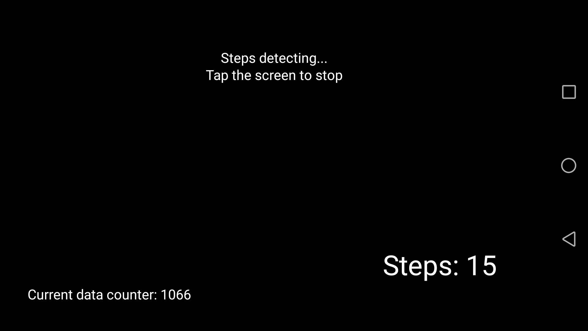
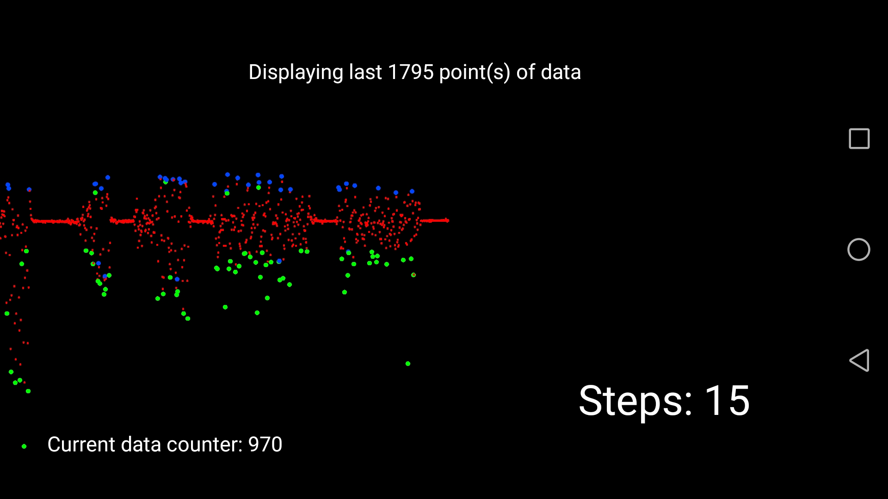

# StepsCounter
Pedometer for Android made using mobile phone sensors

## Table of contents
* [General info](#general-info)
* [Screenshots](#screenshots)
* [Technologies](#technologies)
* [Setup](#setup)
* [Features](#features)

## General info
Project made for the subject Applications for Mobile Devices on the Universitat de Valencia during my Erasmus+ exchange. The project was made to get familiar with prototyping mobile applications using Processing.

## Screenshots
 

## Technologies
* Processing - version 3.5.4
* Ketai

## Setup
The program can be run on Processing using Android mode. After running in Processing the app will be installed on your Android device.

## Features
* counting steps during walks or running

